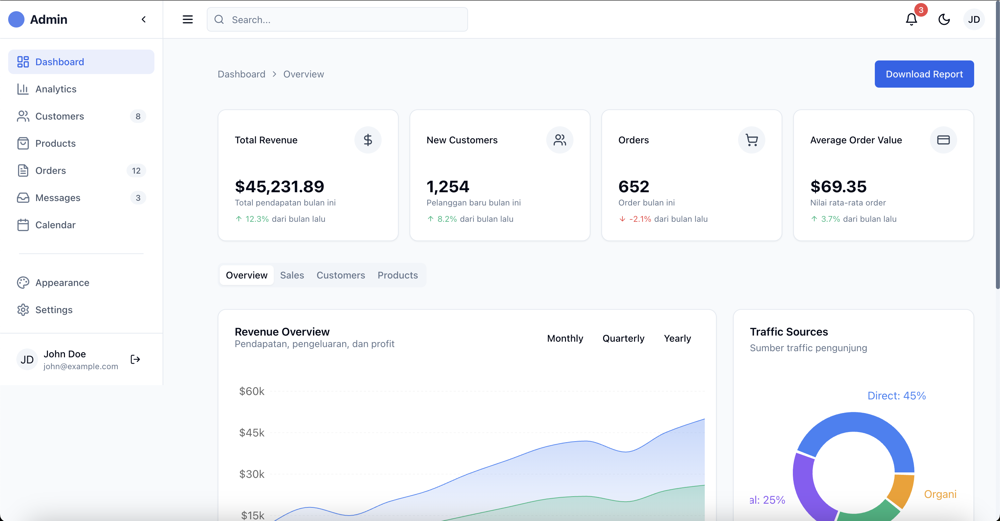

# Admin Dashboard Template

Sebuah template dashboard admin yang modern, responsif dan dapat dikustomisasi, dibangun dengan Next.js, TypeScript, dan Tailwind CSS. Template ini menyediakan dasar yang solid untuk membuat aplikasi web administratif dengan fitur-fitur lengkap.



## 🌟 Fitur Utama

- 🎨 Desain modern dan clean dengan dukungan tema terang/gelap
- 📱 Fully responsive pada semua ukuran perangkat
- 🔐 Autentikasi lengkap (login, register, lupa password)
- 📊 Dashboard dengan visualisasi data interaktif
- 👥 Manajemen pengguna dengan tabel data yang lengkap
- 📦 Manajemen produk dengan fitur filter dan pencarian
- 📈 Halaman analitik dengan berbagai grafik dan statistik
- ⚙️ Panel pengaturan yang komprehensif
- 👤 Halaman profil pengguna
- 🔄 Sidebar yang dapat diperbesar/diperkecil

## 📷 Screenshot

<div style="display: flex; flex-wrap: wrap; gap: 10px; justify-content: center;">
    
    
    
    
    
    
    
</div>

## 🔧 Teknologi yang Digunakan

- **Framework**: [Next.js 14](https://nextjs.org/) dengan App Router
- **Bahasa**: [TypeScript](https://www.typescriptlang.org/)
- **Styling**: [Tailwind CSS](https://tailwindcss.com/)
- **UI Components**: [shadcn/ui](https://ui.shadcn.com/)
- **State Management**: [Zustand](https://zustand-demo.pmnd.rs/)
- **Autentikasi**: [NextAuth.js](https://next-auth.js.org/)
- **Form Handling**: [React Hook Form](https://react-hook-form.com/) dengan [Zod](https://zod.dev/)
- **Data Visualization**: [Recharts](https://recharts.org/)
- **Tabel Data**: [TanStack Table](https://tanstack.com/table/v8)
- **Icons**: [Lucide React](https://lucide.dev/)
- **Animations**: [Framer Motion](https://www.framer.com/motion/)

## 📋 Halaman yang Tersedia

- **Autentikasi**:
  - Login
  - Register
  - Lupa Password
  - Reset Password

- **Dashboard & Analytics**:
  - Overview Dashboard
  - Statistik dan Grafik
  - Analytics

- **Pengelolaan Data**:
  - Manajemen Pengguna
  - Manajemen Produk

- **Settings & Profile**:
  - Profil Pengguna
  - Pengaturan Aplikasi

## 🚀 Cara Memulai

### Prasyarat
- Node.js (versi 18.0.0 atau lebih baru)
- npm, yarn, atau pnpm

### Instalasi

1. Clone repository
   ```bash
   git clone https://github.com/username/admin-dashboard-template.git
   cd admin-dashboard-template
   ```

2. Install dependencies
   ```bash
   npm install
   # atau
   yarn install
   # atau
   pnpm install
   ```

3. Setup file environment
   ```bash
   cp .env.example .env.local
   ```

4. Jalankan server development
   ```bash
   npm run dev
   # atau
   yarn dev
   # atau
   pnpm dev
   ```

5. Buka [http://localhost:3000](http://localhost:3000) di browser Anda

### Login Demo

- **Email**: admin@example.com
- **Password**: admin123

## 🛠️ Scripts

- `npm run dev` - Jalankan server development
- `npm run build` - Build aplikasi untuk production
- `npm run start` - Jalankan build production
- `npm run lint` - Jalankan ESLint

## 🔧 Kustomisasi

Template ini dirancang untuk mudah dikustomisasi:

- Ubah skema warna di `tailwind.config.js`
- Modifikasi komponen UI di `src/components/ui`
- Tambahkan halaman baru di folder `src/app`
- Konfigurasi autentikasi di `src/lib/auth.ts`

## 📱 Responsivitas

Template ini sepenuhnya responsif dan bekerja dengan baik pada:
- Desktop (1024px dan lebih besar)
- Tablet (768px - 1023px)
- Mobile (hingga 767px)

## 🌐 Browser Support

- Chrome (versi terbaru)
- Firefox (versi terbaru)
- Safari (versi terbaru)
- Edge (versi terbaru)

## 📜 License

[MIT License](./LICENSE)

## 🙏 Credits

- UI Components dari [shadcn/ui](https://ui.shadcn.com/)
- Icons dari [Lucide Icons](https://lucide.dev/)
- Grafik menggunakan [Recharts](https://recharts.org/)

---

Dibuat dengan ❤️ oleh [Your Name](https://github.com/yourusername)